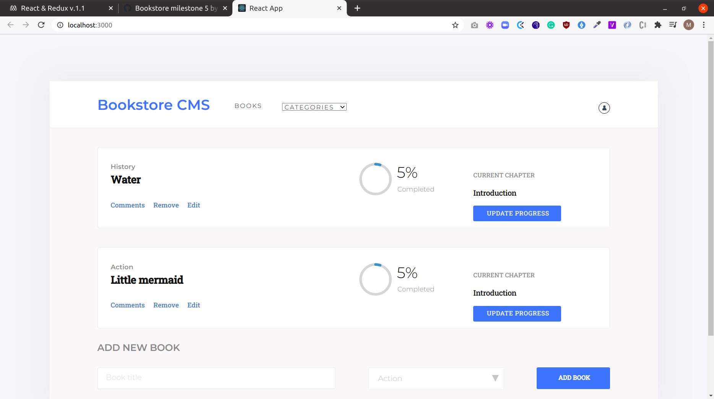

# Bookstore


## Project description
A simple bookstore application built using React and Redux.

## Screenshot


## Built with
- Javascript
- Javascript design patterns
- Node.js
- React.js
- Redux

## Live Demo link
[Bookstore CMS on heroku](https://bookstore-app-cms.herokuapp.com/)


## Getting Started

To get a local copy up and running follow these simple example steps.

## Prerequisites

- Install node.

## Set up

- Clone the project.
- Cd into the project directory.
- Run ```yarn install``` to install dependencies in package.json.
- Run ```npm start``` and view the page on your localhost.


## Contributions

 If you see something wrong or not working, please check [the issue tracker section](https://github.com/blackpintz/Bookstore/issues), if that problem you met is not in already opened issues then open a new issue by clicking on `new issue` button.


## Author

👤 **Rose Wanjohi**
- Github: [@blackpintz](https://github.com/blackpintz)
- Twitter: [@blackpintz](https://twitter.com/blackpintz)

👤 **Marylene Sawyer**
- Github: [@Bluette1](https://github.com/Bluette1)
- Twitter: [@MaryleneSawyer](https://twitter.com/MaryleneSawyer)
- Linkedin: [Marylene Sawyer](https://www.linkedin.com/in/marylene-sawyer)

## Acknowledgements

- [Zeplin](https://app.zeplin.io/) for the bookstore design.
- [Microverse](https://www.microverse.org/)

## Show your support

Give a ⭐️ if you like this project!
